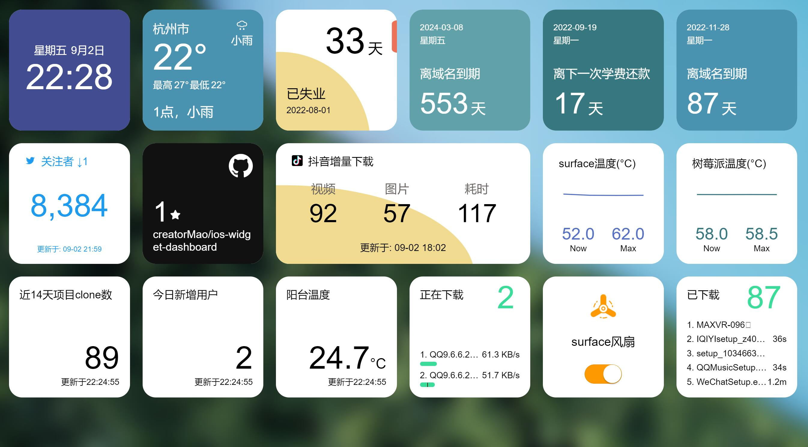

# dashboard
一个ios小组件风格的仪表盘

A ios widget style dashboard

<a href="https://creatormao.github.io/ios-widget-dashboard/#/" target="_blank">在线效果预览地址</a>


</img>


## 技术栈
- Vue2
- Less

## 使用步骤

### 1.安装依赖
```
npm install
```

### 2. 启动开发环境

```
npm run serve
```

### 3. 按需修改配置

路径:\src\views\dashboardConfig.js

```
import bg1 from '@/assets/dashboard-bg1.jpg'

const config = [
  {
    id: 'home',
    backgroundImg: bg1,
    componentList: [
      {
        id: '0',
        componentName: 'Time',
        interval: 1000,
        size: 'default'
      },
      {
        id: '11',
        componentName: 'CommemorationDate',
        size: 'default',
        extData: {
          title: '已失业',
          date: '2022-08-01'
        }
      },
      {
        id: '1',
        componentName: 'CountDown',
        size: 'default',
        extData: {
          title: '域名到期',
          date: '2024-03-08'
        }
      },
      {
        id: '3',
        componentName: 'CountDown',
        size: 'default',
        extData: {
          title: '下一次学费还款',
          dayList: ['01', '19', '22']
        }
      },
      {
        id: '9',
        componentName: 'CountDown',
        size: 'default',
        extData: {
          title: '域名到期',
          date: '2022-11-28'
        }
      },
      {
        id: '7',
        componentName: 'TwitterFollowers',
        size: 'default',
        interval: 1000 * 60 * 30,
        extData: {
          requestInfo: {
            url: ''
          }
        }
      },
      {
        id: '81',
        componentName: 'GitHubRepoStars',
        size: 'default',
        interval: 1000 * 60 * 30,
        extData: {
          personalAccessToken: '',
          owner: 'creatorMao',
          repo: 'ios-widget-dashboard'
        }
      },
      {
        id: '8',
        componentName: 'TikTokDownloadStatus',
        interval: 1000 * 60 * 30,
        size: 'default-long',
        extData: {
          requestInfo: {
            url: ''
          }
        }
      },
      {
        id: '811',
        componentName: 'LineChart',
        size: 'default',
        interval: 1000 * 60,
        extData: {
          title: 'surface温度',
          unitText: '°C',
          maxLength: 20,
          echartsSetting: {
            yAxis: {
              min: 0,
              max: 120
            }
          },
          requestInfo: {
            url: 'http://192.168.1.201:8888/api/cpu/temp',
            valueStructurePath: '.result[0].Sensors[2].Temp'
          }
        }
      },
      {
        id: '8111',
        componentName: 'LineChart',
        size: 'default',
        interval: 1000 * 60,
        extData: {
          color: '#377880',
          title: '树莓派温度',
          unitText: '°C',
          maxLength: 20,
          echartsSetting: {
            yAxis: {
              min: 0,
              max: 120
            }
          },
          requestInfo: {
            url: '',
            config: {
              headers: {

              }
            },
            valueStructurePath: '.values.CurrentTemperature'
          }
        }
      },
      {
        id: '999',
        componentName: 'GitHubRepoCloneTraffic',
        size: 'default',
        interval: 1000 * 60 * 60,
        extData: {
          personalAccessToken: '',
          owner: 'creatorMao',
          repo: 'ios-widget-dashboard'
        }
      },
      {
        id: '9991',
        componentName: 'CommonCount',
        size: 'default',
        interval: 1000 * 60 * 30,
        extData: {
          title: '今日新增用户',
          requestInfo: {
            url: '',
            valueStructurePath: '.FOLLOWERS_COUNT_CHANGE_TODAY'
          }
        }
      },
      {
        id: '999111',
        componentName: 'CommonCount',
        size: 'default',
        interval: 1000 * 60 * 5,
        extData: {
          title: '阳台温度',
          unitText: '°C',
          requestInfo: {
            url: '',
            config: {
              headers: {
              }
            },
            valueStructurePath: '.values.CurrentTemperature'
          }
        }
      },
      {
        id: '9991111',
        componentName: 'DownloadInfo',
        size: 'default',
        interval: 1000 * 10,
        headerData: {
          title: 'aria2下载'
        },
        extData: {
          requestInfo: {
            url: 'http://192.168.1.11:6800/jsonrpc',
            config: {
              method: 'post',
              data: {
              }
            }
          },
          resultStructure: {
            list: '.result',
            fields: {
              fileName: '.fileName',
              fileId: '.gid',
              downloadSpeed: '.downloadSpeed',
              uploadSpeed: '.uploadSpeed',
              completedLength: '.completedLength',
              totalLength: '.totalLength'
            }
          }
        }
      },
      {
        id: '111111111',
        componentName: 'SwitchButton',
        size: 'default',
        interval: 1000 * 10,
        extData: {
          title: 'surface风扇',
          requestInfo: {
            url: '',
            config: {
              headers: {
              }
            },
            valueStructurePath: '.values.On'
          }
        }
      }
    ]
  },
  {
    id: 'work',
    backgroundImg: bg1,
    componentList: [
      {
        id: '0',
        componentName: 'Time',
        interval: 1000,
        size: 'default'
      }
    ]
  }
]

export {
  config
}
```
